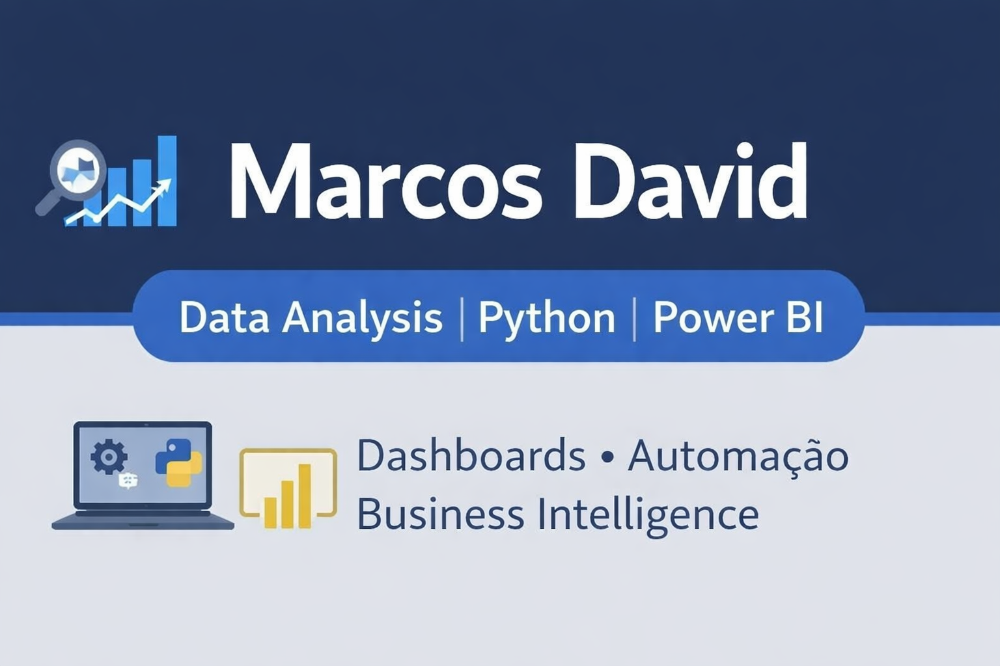

# Olá, eu sou Marcos Rogério David 👋

🎓 Estudante de Análise e Desenvolvimento de Sistemas  
📊 Focado em Análise de Dados  
📍 Brasil  

---

## 🚀 Sobre mim

Sou estudante de tecnologia com foco em **Análise de Dados**.  
Estou desenvolvendo projetos práticos utilizando ferramentas modernas para transformar dados em informações estratégicas para negócios.

---

## 🛠️ Tecnologias e Ferramentas

---

## 📊 Projetos em Destaque

### 📈 Dashboard Comercial – Power BI
Projeto de análise de vendas com visualização interativa.

🔗 Repositório  
https://github.com/MarcosRDavid/dashboard-comercial-powerbi

---

## 📈 Estatísticas do GitHub

---

## 📫 Contato

💼 LinkedIn  
https://www.linkedin.com/in/marcosdavidads

📧 Email  
marcosrogerio0777@gmail.com
